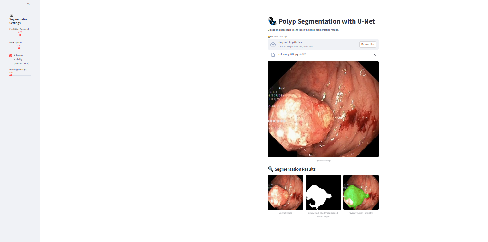

🧠 Colorectal Polyp Segmentation using U-Net

This project uses the U-Net deep learning model to automatically detect and segment colorectal polyps in colonoscopy images.
Polyp detection helps in early diagnosis of colorectal cancer, supporting doctors in faster and more consistent decision-making.

🔍 What this project does

Trains a U-Net model on colonoscopy images to highlight polyps.

Uses improved training techniques like:

Data Augmentation (Albumentations)

Dice + Focal Loss

IoU & Dice metrics

EarlyStopping & ReduceLROnPlateau

Provides a Streamlit app for easy image segmentation and visualization.

Dockerized for easy deployment anywhere.

📁 Dataset Used

Kvasir-SEG Dataset
Download from Kaggle 👉 Kvasir-SEG

📂 Project Structure
```
polyp_segmentation/
│── frontend/
│   └── app.py                 # Streamlit web app
│
│── train/
│   └── train.py               # Training script for U-Net
│
│── model/
│   └── best_unet_model_v1.h5  # Trained model
│
│── requirements.txt           # Project dependencies
│── README.md                  # Project overview
│── Dockerfile                 # For building Docker image
```

🚀 How to Run

🔹 1. Train the Model
cd train
python train.py

This will save the trained model in model/best_unet_model_v1.h5.

🔹 2. Run Streamlit App
cd frontend
streamlit run app.py


This will open the app in your browser (default: http://localhost:8501).

🔹 3. Run with Docker
1. Build the image
docker build -t polyp_segmentation_app .

2. Run the container
docker run -p 8501:8501 polyp_segmentation_app

✅ Techniques Used

U-Net Architecture for segmentation

Combined Loss (Dice + Focal) for class imbalance

Metrics: IoU & Dice

Callbacks: EarlyStopping, ReduceLROnPlateau

Data Augmentation: Albumentations (flips, rotations, etc.)

Regularization: Dropout, BatchNormalization

📊 Demo
Here’s the user interface where a colonoscopy image is uploaded and the segmented polyp result is displayed:  



🌍 Why it Matters

This project demonstrates how deep learning can support automatic medical image analysis, reducing manual effort, and improving diagnostic speed and accuracy.
